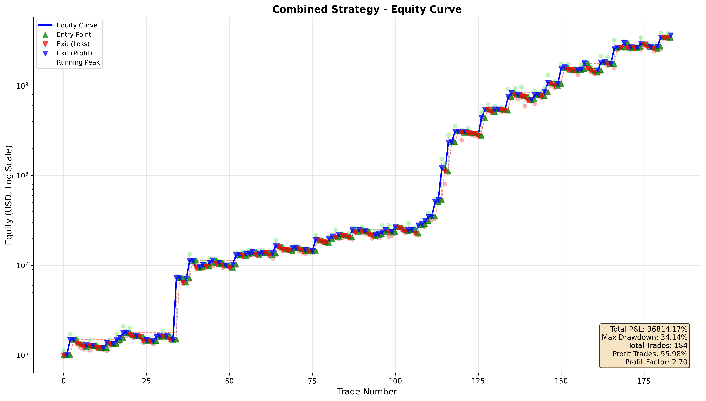

# 背景

为什么会有这个代码库,首先在昨天的李二二直播课的加餐篇提到了以损定仓的理论,让我意识到虽然我们仅仅是使用二哥开发的策略,但是如果不能够对每一个策略都有很好的理解,那岂不是没有办法做到以损定仓.至少我要知道这个策略的最大回撤是多少吧.

昨天二哥又再次对特斯拉进行了ma530策略以及特斯拉'的策略的一个介绍.开始我对这个策略还不太感冒,这是基于我个人原因:因为我是小散户,资金比较小,需要集中全部资金买一支股票,如果在美股只买一支股票,那大概率就是英伟达.

但是我现在想基于以下几点原因对这个策略重新起来:

 - 该策略基于特斯拉,而特斯拉正处于放大招的边缘,ma530能够很好的跟踪大趋势
 - 该策略有一个极高胜率的策略作为补充,买AZO
 - AZO应该是在熊市6君子里面,如果遇到熊市,我买入AZO的时候不会太没有道理(今天还额外写了一个策略,就是看标普500低于225均线的时候持有AZO会不会亏损,结果真的不会,还有63%胜率+4.2盈利因子+38.9%最大回撤+37年17倍收益,年复合8%收益)

于是夜里就在想,单独的特斯拉ma530策略可以做到30多倍的收益率,单独的特斯拉‘策略可以做到9倍的收益,那么如果两个策略结合起来,结果会是什么样的呢?于是,我询问AI尝试在tradingview上面来计算两个策略结合的结果,结果没办法做到,原因是pinescript的策略无法做到对两个品种同时进行买卖.没办法,我只能把两种策略生成的交易列表下载下来,然后用python程序计算一下对应的数值吧.

于是乎,我们这个代码库其实就是做了一件事情:计算出两个策略同时运行的表现情况:

直接上结论:
该策略的92*2笔交易的收益率是3653倍,最大回撤34.14%,胜率55.98%,盈利因子2.70
如图:

供大家参考,希望能够帮到大家.

# 说明

文件:
代码: ./calculate_tsla_ma530_and_reverse_tsla.py
运行:

```
    python3 -m venv path/to/venv
    source path/to/venv/bin/activate
    python3 -m pip install pandas
    python3 -m pip install matplotlib
    python3 calculate_tsla_ma530_and_reverse_tsla.py
```
输入数据:

    ma530策略购买特斯拉交易列表数据:         ./trades_strategy_A.csv

    ma530购买特斯拉‘策略购买AZO交易列表数据:  ./trades_strategy_B.csv

输出数据: 

    ma530策略购买特斯拉数据图:              ./strategy_A_equity_curve.png

    ma530购买特斯拉‘策略数据图:             ./strategy_B_equity_curve.png

    组合策略表现数据图:                     ./combined_strategy_equity_curve.png

原始策略代码:

    ma530策略:                            ./ma530_crossover_strategy.pine
    ma530_reverse策略:                    ./buy_azo_on_reverse530_strategy.pine


# 备注

由于没有日线对应品种的OHLC数据,所以对于最大回撤的运算只能采取一种近似的计算,但是应该跟真实结果差不了太多,这块由于没有日线的数据,导致用AI生成的程序计算出来的动态最大回撤比较离谱,这块调试了好几个小时,也应证了如果不完全理解AI的代码,debug真的是一件痛苦的事情.
我这里采用的是按照当前这笔交易的最大回撤和交易内最大回撤取最大值,也就是输入数据的“Adverse excursion %”列作为参考计算出来的,单独的策略A和策略B即对应的“ma530策略购买特斯拉数据图”和“ma530策略购买特斯拉数据图”的结果跟tradingview大差不差,即说明我的结果基本正确.


